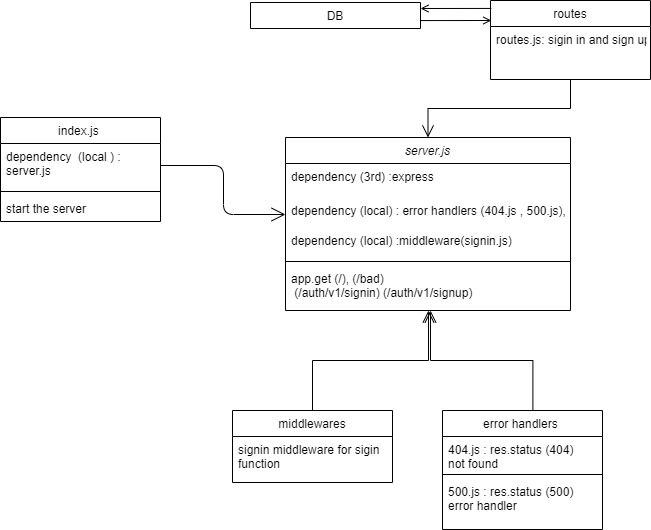

# basic-auth

this project is a practice prioject for lab 06 of 401 course at asac

- **Author** : hiba salem

- ### description

Authentication System Phase 1: Deploy an Express server that implements Basic Authentication, with signup and signin capabilities, using a Mongo database for storage.

---

- ### NML



---

- ### [PR](https://github.com/hibasalem/basic-auth/pull/1)

---

- ### deploy links

  - [ deployment](https://basic-authmain.herokuapp.com)

  - [tests report](https://github.com/hibasalem/basic-auth/actions)

---

- ### getting this app

  - clone and npm i --production.
  - npm start or nodemon

---

- ### Setup

  - `.env requirements`
  - `PORT` - Port Number

---

- ### end points

  - post `/api/v1/signup`

  - data `{ username: 'hiba', password: '12345'};`

  ```
  {
    "_id": "60e22052a457e17b38c76013",
    "username": "hiba",
    "password": "$2b$10$9IrrHcpcZdHXLWNi.B9ZheFC9gtNytKHtgQD4WkfEhZJJZ2ZzMW9u",
    "__v": 0
  }

  ```

  - post `/api/v1/signin`

  - data `{ username: 'hiba', password: '12345'};`

  ```
  {
  "Wrong User / password"
  }

  ```

  - post `/api/v1/signin`

  - data `{ username: 'hiba0000', password: '12345000000'};`

  ```
  {
    "_id": "60e22052a457e17b38c76013",
    "username": "hiba",
    "password": "$2b$10$9IrrHcpcZdHXLWNi.B9ZheFC9gtNytKHtgQD4WkfEhZJJZ2ZzMW9u",
    "__v": 0
  }

  ```

  - `/`

  ```

  {
  home route
  }

  ```

  - `/bad`

  ```

  {
  "error": "some thing went wrong"
  }

  ```

---

- ### test this app

  - clone and npm i -D.
  - npm test

---

- ## tests

  - response with 404 on a bad route
  - response with 404 on a bad method
  - sign up with new data
  - sign up with existing data
  - sign in with correct user data
  - sign in with uncorrect user data
